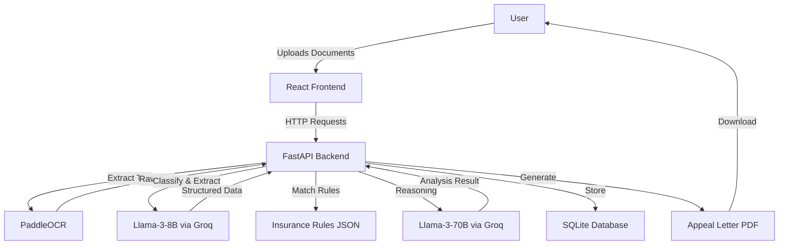

# 🏥 Hackios - Health Insurance Denial Prevention & Appeal Assistant

An AI-powered full-stack web application that helps patients prevent claim denials, understand denial letters, and generate professional appeal letters using advanced LLM technology.


---

## ✨ Features

> **Note**: This project has been tested and updated with all necessary fixes for Windows compatibility, dependency conflicts, and API changes. See [CONTRIBUTING.md](CONTRIBUTING.md) for details.

### 🔍 Pre-Claim Denial Prevention
- Upload medical bills, doctor notes, and EOBs
- AI analyzes documents against insurance requirements
- Get denial risk score (0-100%)
- Identify missing documentation before claim submission

### 📋 Denial Letter Explanation
- Upload denial letter for analysis
- Get plain-English explanation of denial reasons
- Understand denial codes (CO-50, CO-197, etc.)
- Identify what documentation is missing

### ✍️ Appeal Letter Generation
- Generate professional appeal letters
- Includes medical evidence and policy references
- Professional PDF format ready for submission
- Cites clinical findings and procedure justifications

---

## 🏗️ Architecture



---

## 🛠️ Technology Stack

### Backend
- **FastAPI** - Modern Python web framework
- **PaddleOCR** - Free, open-source OCR for document text extraction
- **Groq API** - Ultra-fast LLM inference
  - **Llama-3-8B-Instruct** - Document classification and field extraction
  - **Llama-3-70B-Instruct** - Complex reasoning and appeal generation
- **SQLAlchemy** - Database ORM
- **SQLite** - Lightweight database for storing analysis history
- **ReportLab** - Professional PDF generation

### Frontend
- **React 18** - Modern UI library
- **Vite** - Lightning-fast build tool
- **Axios** - HTTP client
- **Modern CSS** - Glassmorphism, gradients, animations

---

## 📁 Project Structure

```
Hackios/
├── backend/
│   ├── main.py                 # FastAPI application entry point
│   ├── config.py               # Configuration and environment variables
│   ├── database.py             # SQLAlchemy models and database setup
│   ├── requirements.txt        # Python dependencies
│   ├── ocr/
│   │   └── paddle_ocr.py       # PaddleOCR integration
│   ├── llm/
│   │   ├── extract_llm8b.py    # Llama-3-8B for extraction
│   │   └── reasoning_llm70b.py # Llama-3-70B for reasoning
│   ├── routes/
│   │   ├── upload.py           # File upload endpoint
│   │   ├── analyze.py          # Document analysis endpoint
│   │   ├── appeal.py           # Appeal letter generation
│   │   └── insurance.py        # Insurance plans listing
│   ├── utils/
│   │   ├── pdf_tools.py        # PDF generation utilities
│   │   └── text_cleaner.py     # Text processing utilities
│   └── insurance_rules/
│       ├── aetna_ppo.json      # Aetna PPO coverage rules
│       ├── bluecross_ppo.json  # BlueCross PPO rules
│       ├── unitedhealthcare.json
│       ├── cigna.json
│       └── medicare.json
├── frontend/
│   ├── src/
│   │   ├── App.jsx             # Main application component
│   │   ├── App.css             # Modern styling with glassmorphism
│   │   ├── main.jsx            # React entry point
│   │   ├── components/
│   │   │   ├── FileUpload.jsx  # Drag-and-drop file upload
│   │   │   ├── ChatInterface.jsx # Chat UI
│   │   │   ├── AnalysisResult.jsx # Results display
│   │   │   ├── DenialExplanation.jsx
│   │   │   └── AppealLetter.jsx
│   │   └── services/
│   │       └── api.js          # Backend API integration
│   ├── package.json
│   ├── vite.config.js
│   └── index.html
├── .env.example                # Environment variable template
├── .gitignore
├── SETUP.md                    # Setup instructions
└── README.md                   # This file
```

---

## 🚀 Quick Start

**See [SETUP.md](SETUP.md) for detailed installation instructions.**

### Prerequisites
- Python 3.9+
- Node.js 16+
- Groq API Key ([Get one free](https://console.groq.com))

### Installation

1. **Clone or navigate to the project:**
   ```bash
   cd "c:\My Projects\Medical Hackathons\Hackios\Hackios"
   ```

2. **Install backend dependencies:**
   ```bash
   cd backend
   pip install -r requirements.txt
   ```

3. **Configure environment variables:**
   ```bash
   cd ..
   copy .env.example .env
   # Edit .env and add your Groq API key
   ```

4. **Install frontend dependencies:**
   ```bash
   cd frontend
   npm install
   ```

5. **Run the application:**

   Terminal 1 (Backend):
   ```bash
   cd backend
   python -m uvicorn main:app --reload
   ```

   Terminal 2 (Frontend):
   ```bash
   cd frontend
   npm run dev
   ```

6. **Open in browser:** `http://localhost:5173`

---

## 📖 API Documentation

Once the backend is running, visit `http://localhost:8000/docs` for interactive API documentation powered by Swagger UI.

### Key Endpoints

| Endpoint | Method | Description |
|----------|--------|-------------|
| `/api/upload` | POST | Upload documents (PDF/images) and run OCR |
| `/api/analyze` | POST | Analyze documents with LLMs |
| `/api/appeal-letter` | POST | Generate appeal letter PDF |
| `/api/insurance-plans` | GET | List available insurance plans |

---

## 🎨 UI Design

The frontend features a **modern medical dashboard** design:

- 🎨 **Glassmorphism** - Frosted glass cards with blur effects
- 🌈 **Medical color palette** - Blues, teals, professional aesthetic
- ⚡ **Smooth animations** - Fade-ins, slides, and micro-interactions
- 📱 **Responsive design** - Works on desktop and tablet
- 🔴🟡🟢 **Color-coded risk scores** - Visual denial risk indicators

---

## 💾 Database Schema

### Tables
- **uploaded_documents** - Stores file metadata and OCR results
- **analysis_sessions** - Tracks analysis sessions
- **extracted_data** - Stores structured extraction results
- **generated_appeals** - Stores appeal letter content
- **reasoning_results** - Stores LLM reasoning outputs

---

## 🧪 Workflows

### Workflow 1: Pre-Claim Denial Prevention
1. User uploads: Medical bill + Doctor note
2. Selects insurance plan (optional)
3. System extracts CPT codes, ICD codes, procedure details
4. Compares against insurance requirements
5. Returns denial risk score and missing requirements

### Workflow 2: Denial Explanation
1. User uploads: Denial letter
2. System extracts denial code and reason
3. Explains in simple English why claim was denied
4. Suggests next steps

### Workflow 3: Appeal Letter Generation
1. User uploads: Denial letter + Doctor note + Bill
2. System drafts formal appeal letter with:
   - Medical evidence citations
   - Denial code refutation
   - Policy compliance arguments
3. Generates professional PDF for submission

---

## 🔐 Security & Privacy

- All processing happens locally (OCR and database)
- Only extracted text sent to Groq API for LLM processing
- No PHI (Protected Health Information) is permanently stored in cloud
- SQLite database stored locally
- Uploaded files stored in local `backend/uploads/` folder

---

## 🤝 Contributing

This is a hackathon project. For improvements:
1. Fork the repository
2. Create a feature branch
3. Make your changes
4. Submit a pull request

---

## 📄 License

This project is open-source for educational and hackathon purposes.

---

## 🙏 Acknowledgments

- **PaddleOCR** - Free OCR engine
- **Groq** - Ultra-fast LLM inference
- **Meta** - Llama-3 models
- **FastAPI** - Modern Python web framework
- **React** - UI library

---

## 📞 Support

For issues or questions:
1. Check [SETUP.md](SETUP.md) for installation help
2. Review API docs at `http://localhost:8000/docs`
3. Ensure Groq API key is configured correctly

---

**Built with ❤️ for improving healthcare accessibility**
